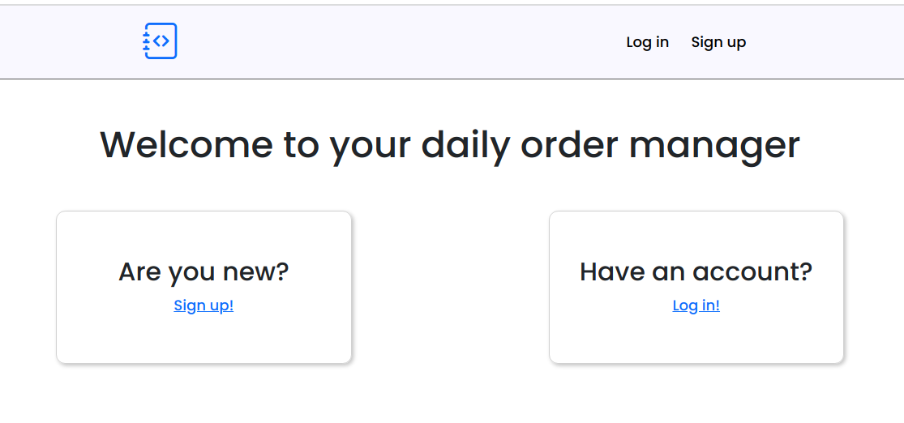
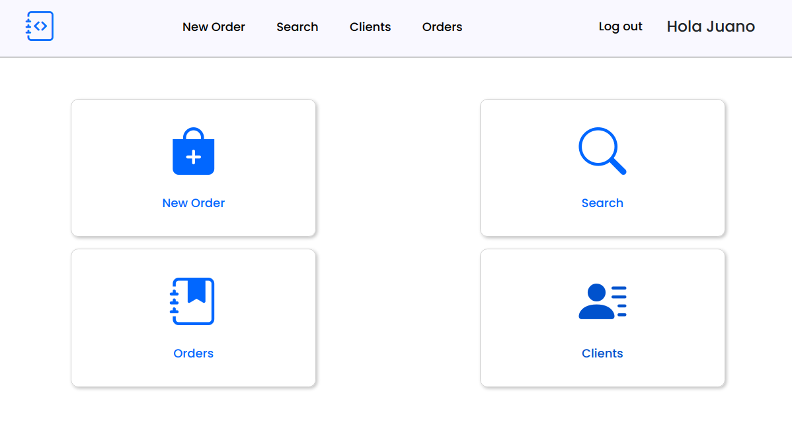

# Order Manager frontend

This is the front-end side of an app that handles the process of handling orders for a fictional retail company.

Table of Contents 
================= 

\* [Order Manager frontend](#order-manager-frontend) 
  \* [How to run in local](#how-to-run-in-local) 
  \* [Test the deployed version](#test-the-deployed-version) 
  \* [How to use](#how-to-use) 
  \* [Video](#video)

## How to run in local

Make sure to first run the project [Order Manager api](https://github.com/Sebas93cay/Order_Manager_api)

Clone the repository

```
git clone https://github.com/Sebas93cay/Order_Manager_frontend.git
cd Order_Manager_frontend
```

Install project dependencies

```
npm install
```

Run start script

```
npm start
```

Now you can go to to localhost:3000 and start using the application

## Test the deployed version

Go to [sebas93cay.github.io/Order_Manager_frontend](https://sebas93cay.github.io/Order_Manager_frontend) and start playing with the clients and orders. The interface is responsive, so feel free to test it in a mobile device as well :)

## How to use

You need to create a user to use the app. Just go to sign up and provide a name, email (it can be fake) and a password. From then on you will use that email and password to log in.

<center></center>

Once you are logged in, there are 4 main actions to perform in the app

- **Create a new order**, in here you can create a new order for an existing or new client, add payments and shipping information.
- **Search for order**, you can search for order by 3 different ways:
  - By order Id
  - By dates
  - By shipping information
- **Show all orders**
- **Show all clients**

<center></center>

## Video

This was my first serious project for my portfolio, so I did a fun video about it. I hope you can check it out :)

 <center><a href="https://www.linkedin.com/posts/sebscaicedo_project-video-react-activity-6884715037630443520-nx1f">Video</a></center>
